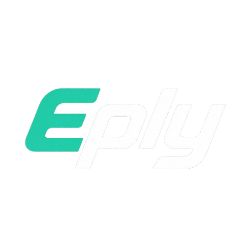

# ⚡ EPLY QUEST — Built By Eply

> A lightweight Discord.js quest-management bot with slash commands, automated quest completion, points, giveaways, tickets and more.

<p align="center">
  
</p>

---

## 🧩 COMMANDS

| Command      | Function                                      |
| :----------- | :-------------------------------------------- |
| `/link`      | Connect an account to the bot                 |
| `/quest`     | Process an individual quest                   |
| `/questall`  | Process all available quests                  |
| `/autoquest` | Run quest processing automatically            |
| `/help`      | Full command overview with a section menu     |

Plus: `/questlist` · `/status` · `/unlink` · `/feedback` · `/suggest` · `/ticket` · `/shop` · `/buy` · `/profile` · `/leaderboard` · `/giveaway` · `/remind` · `/userinfo` · `/serverinfo` · `/ping` — and admin tools: `/givepremium` · `/removepremium` · `/givepoints` · `/welcomer`.

---

## 👑 OWNER

The **bot owner** has permanent premium and every admin permission (give premium, remove premium, give points, questall bypass, …).

Set your owner ID in `.env`:

```env
OWNER_ID=1538668813355192340
```

The owner cannot lose premium — `removepremium` is a no-op against the owner, and premium access is enforced in code even if `premium.json` is wiped.

---

## 🔧 SETUP

### 1. Install dependencies

```bash
npm install
```

> This package already ships with `node_modules` — you only need this if you delete it.

### 2. Configure the bot

Edit `.env` beside `src/index.js`:

```env
DISCORD_TOKEN=your_bot_token
DISCORD_CLIENT_ID=your_client_id
BOT_PREFIX=!
OWNER_ID=1538668813355192340
QUEST_ROLE_ID=
QUEST_LOG_CHANNEL_ID=
```

### 3. Launch

```bash
npm start
# or: node src/index.js
```

---

## 🖼️ LOGO

The bot automatically uses `assets/logo.png` as its Discord avatar on startup (only re-uploads when the file changes — Discord rate-limits avatar updates). Replace that file to change the branding.

---

## 🔐 ENVIRONMENT

| Name                  | Required | Purpose                         |
| --------------------- | :------: | ------------------------------- |
| `DISCORD_TOKEN`       |    ✅    | Bot authentication token        |
| `DISCORD_CLIENT_ID`   |    ✅    | Discord application ID          |
| `BOT_PREFIX`          |    ❌    | Prefix for text commands        |
| `OWNER_ID`            |    ❌    | Owner user ID (premium + admin) |
| `QUEST_ROLE_ID`       |    ❌    | Role allowed to use questall    |
| `QUEST_LOG_CHANNEL_ID`|    ❌    | Channel for quest log embeds    |

---

## 📌 IMPORTANT

* Make sure the necessary Discord Gateway Intents are enabled.
* Slash commands registered globally may not appear immediately.
* Keep your `.env` file private and never commit your bot token.
* ⚠️ If you ever received this project as a zip from someone else, **regenerate your bot token** in the Discord Developer Portal before use — shipped zips sometimes contain old `.env` files.

---

## 🌐 EPLY QUEST

**Built By Eply**

---

### `EPLY QUEST` · Discord Quest Tools · Built By Eply
